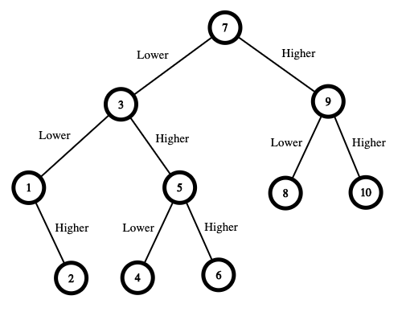

# 375. 猜数字大小 II
https://leetcode-cn.com/problems/guess-number-higher-or-lower-ii/

我们正在玩一个猜数游戏，游戏规则如下：

我从 1 到 n 之间选择一个数字，你来猜我选了哪个数字。

每次你猜错了，我都会告诉你，我选的数字比你的大了或者小了。

然而，当你猜了数字 x 并且猜错了的时候，你需要支付金额为 x 的现金。直到你猜到我选的数字，你才算赢得了这个游戏。

示例（注意，本例子并不是基于二分法来作选择的）:

n = 10, 我选择了8.

第一轮: 你猜我选择的数字是5，我会告诉你，我的数字更大一些，然后你需要支付5块。
第二轮: 你猜是7，我告诉你，我的数字更大一些，你支付7块。
第三轮: 你猜是9，我告诉你，我的数字更小一些，你支付9块。

游戏结束。8 就是我选的数字。

你最终要支付 5 + 7 + 9 = 21 块钱。

**给定 n ≥ 1，计算你至少需要拥有多少现金才能确保你能赢得这个游戏。**

## Example 1:



```
Input: n = 10
Output: 16
```

Explanation: The winning strategy is as follows:
- The range is [1,10]. Guess 7. （为什么第一次选择该值呢？）
    - If this is my number, your total is $0. Otherwise, you pay $7.
    - If my number is higher, the range is [8,10]. Guess 9.
        - If this is my number, your total is $7. Otherwise, you pay $9.
        - If my number is higher, it must be 10. Guess 10. Your total is $7 + $9 = $16.
        - If my number is lower, it must be 8. Guess 8. Your total is $7 + $9 = $16.
    - If my number is lower, the range is [1,6]. Guess 3.
        - If this is my number, your total is $7. Otherwise, you pay $3.
        - If my number is higher, the range is [4,6]. Guess 5.
            - If this is my number, your total is $7 + $3 = $10. Otherwise, you pay $5.
            - If my number is higher, it must be 6. Guess 6. Your total is $7 + $3 + $5 = $15.
            - If my number is lower, it must be 4. Guess 4. Your total is $7 + $3 + $5 = $15.
        - If my number is lower, the range is [1,2]. Guess 1.
            - If this is my number, your total is $7 + $3 = $10. Otherwise, you pay $1.
            - If my number is higher, it must be 2. Guess 2. Your total is $7 + $3 + $1 = $11.

The worst case in all these scenarios is that you pay $16. Hence, you only need $16 to guarantee a win.

最坏情况下都能赢，才叫做“确保”赢。
最坏的情况下是指在博弈双方都选择最优解的情况下，你从他所有最优解里面选择一个对自己利益最大的（或表达为对自己损失最小的），简称极大值极小值（极小化极大问题）。
10 的情况下你优先选择 7 应该最优，因为不管对方接下来说大了还是小了，你最坏都能达到 16（7+9，7+3+5, 7+3+1）

## Example 2:

```
Input: n = 1
Output: 0
```

Explanation: There is only one possible number, so you can guess 1 and not have to pay anything.


## Example 3:

```
Input: n = 2
Output: 1
```
Explanation: There are two possible numbers, 1 and 2.
- Guess 1.
    - If this is my number, your total is $0. Otherwise, you pay $1.
    - If my number is higher, it must be 2. Guess 2. Your total is $1.

The worst case is that you pay $1.
    
## Example 4:

结果集如下：

```
if n==1:return 0
elif n==2:return 1
elif n==3:return 2
elif n==4:return 4
elif n==5:return 6
elif n==6:return 8
elif n==7:return 10
elif n==8:return 12
elif n==9:return 14
elif n==10:return 16
elif n==16:return 34
elif n==18:return 42
elif n==25:return 64
elif n==45:return 144
elif n==56:return 198
elif n==63:return 226
elif n==77:return 282
elif n==83:return 310
elif n==94:return 365
elif n==109:return 454
elif n==115:return 494
elif n==120:return 529
elif n==139:return 630
elif n==141:return 640
elif n==151:return 698
elif n==160:return 743
elif n==176:return 823
elif n==183:return 858
elif n==191:return 898
elif n==200:return 952
```

## Constraints:

1 <= n <= 200
